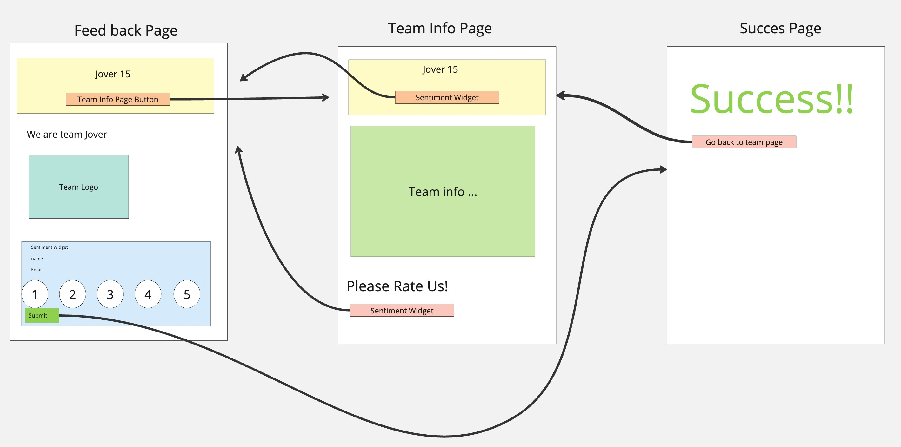

# Introduction

## Purpose
This task is a warmup excercise for CSE110 and we are building a sentiment widget. The sentiment widget is designed to visual so that it is a visually appealing 
website.

## Website Pipeline
The following schema (created in miro) is used to illustrate our webset design

## Progaming Langues Used
In this task, we have used only CSS, html, Javascript, and Markdown

## Dependencies
None, we have not used any outside libraries

## Environment Setup
We use only raw JS, Html and CSS so no further environmental set-up

## CSS
All CSS classes/templates are located in \css. The default styling is in "styles.css" but if you want a custom css file, place it in this folder and follow the naming convention "HTMLFILENAME_style.css"

## Pages
we have three pages, index.html which is our home page, dummy_form.html which is our sentiment widget which can be reused as a template, and our success.html which is a succspage for a succesful submission.

If you want to add a new page, add it to \html folder with a simple name, all lowercase

## images
all images should be put into the \images repository.

## Tests
All tests are found in the \tests directory. For each file name them "HTMLFILENAME_test.html", and for each test right a comment descibing what part you are testing

## Deployment
We are deploying this website using github pages were all our webpages, index.html (team page), dummy_doc.html (sentiment_widget) and  success.html (success page for form submission)
